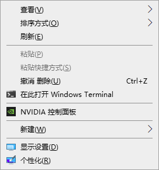
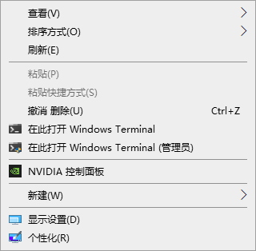

+++
title = "Windows Terminal 右键设置"
subtitle = ""
date = "2022-09-19T00:07:03+08:00"
description = ""
tags = ["Windows Terminal"]
comment = true
draft = false
+++

需要先看这里：[SplitGemini/windowsterminal-shell](https://github.com/SplitGemini/windowsterminal-shell)

这里给出的是一些使用时的建议：

以**管理员身份**启动 PowerShell 7

```powershell 
wget https://raw.githubusercontent.com/SplitGemini/windowsterminal-shell/master/install.ps1
.\install.ps1 mini -MenuType OnlyUser
.\install.ps1 mini -Extended -MenuType OnlyAdmin 
```

生成结果如下





如果右键菜单下还有在此打开 powershll 窗口等项可以参考 *[Win10 恢复 Shift + 右键菜单 “在此处打开命令窗口” ](https://zhuanlan.zhihu.com/p/38166769)* 去除
